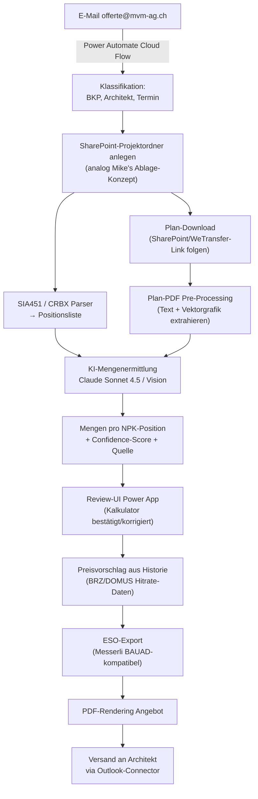

# KI-Ausmass MVM (Devis-Copilot)

**Klient:** [[50.work/26_Firmen/MVM-AG|MVM AG]]
**Lead Miraglia-BI:** Raoul Elias Miraglia · **Mit:** Giovanni Miraglia, [[50.work/26_Firmen/Castelli-Solutions|Alessandro Castelli]], [[50.work/26_Firmen/Kipfer-DP|Michael Kipfer]]
**Lead MVM:** Reto Limacher (Offertwesen) · **Sponsor:** [[50.work/25_People/Sascha Ziswiler|Sascha Ziswiler]]
**Status:** Daten-Analyse abgeschlossen — Prototyp-Vorbereitung
**Ziel (Sascha, 28.05.2026):** «Bis 31.12.2026 erstellt die KI-Lösung selbstständig und zuverlässig Ausmassberechnungen aus Plänen, sodass diese im Offertwesen produktiv eingesetzt werden können.»
**Ziel Raoul:** rascher MVP/Prototyp, nicht Ende-Jahr-Wasserfall.

> Verwandt im Hub: [[Obsidian gimi/Miragliag/20_Clients/MVM_AG|MVM_AG.md (Giovanni)]] — Abschnitt _Power Platform Apps & Prozesse → Backlog «Ausschreibungs-/Devis-Copilot»_ ist bereits dokumentiert (evaluierte Tools: Togal.ai, Kreo, MeasureSquare, Bluebeam, RA Scale).

## Worum geht es

MVM erhält Offertanfragen für Maler-, Gipser- und Fassadenarbeiten als SIA-konforme Devisierungen plus Architekten-Pläne. Heute ermittelt der Kalkulator die **Mengen pro NPK-Position manuell aus den Plänen** (zeitaufwändig, fehleranfällig). Die KI soll diesen Schritt automatisieren und im Messerli-BAUAD-Format zurückspielen.

## Datenstand 2026-06-04

**Quelle:** SharePoint-Upload Reto Limacher, lokal gespeichert unter
`/Users/raouleliasmiraglia/Library/CloudStorage/Dropbox/Miraglia-BI/MVM/Ausmass/OneDrive_1_4.6.2026.zip`
(4.78 GB, entpackt in `…/MVM/Ausmass/extracted/`).

### Projekte im Trainingsset (6 Anfragen, 4 Bauvorhaben)

| Bauvorhaben | Architekt / GU | Gewerke | Anfrage-Datum | Eingabesumme |
|---|---|---|---|---|
| **2100 Bleicherstrasse 10, Luzern** (Ersatzneubau, Migros + Wohnungen, Bauherr Dr. Beat Schumacher) | Cerutti Partner Architekten AG (Michael Keller) | **Innere Malerarbeiten** (BKP 285.1) · **Innere Gipserarbeiten** (BKP 271.0) · **Verputzte Fassade + Klinker EG** (BKP 226.2) | Juni 2025 | CHF 343'030 (Maler-Angebot) |
| **GU-5082.1 Bundesplatz 4 / 4a, Luzern** | Eberli Sarnen AG (Till Gasser) | Innere Malerarbeiten BKP 285.1 | Juni 2024 | — |
| **Ameron-Flora Hotel, Luzern** (Renovation, Lobbyumbau, Werkverträge, Nachträge) | direkt MVM (vorhandenes Stammkundenprojekt) | Maler/Tapezier inkl. Tapeten-Nachbestellungen Wall&Deco, Sikkens-Lacke | 2023-2026 | mehrere Werkverträge |
| **224 Grundmatt, Baar** | blu architekten (Gilen Balanzategi) | Fassadenarbeiten | Dezember 2025 (Re-Anfrage) | — |

### Dateitypen (483 Einträge total)

| Typ | Anzahl | Bedeutung |
|---:|---:|---|
| **.pdf** | 372 | Pläne (Grundrisse, Schnitte, Ansichten), Devis-Print, Angebote, Abgebote |
| **.jpg / .png** | 28 | Eingebettete Bilder, Visualisierungen, Materialmuster |
| **.xlsx / .xlsm / .xls** | 31 | Terminprogramme, Tariflisten, eigene Kalkulationen |
| **.msg** | 17 | Original-Outlook-E-Mails (Offertanfrage, Abgebot-Runde, Präzisierung) |
| **.crbx** | 9 | **CRB-/NPK-Format (ZIP enthält `SIAFILE.e1s`)** — Input vom Architekt |
| **.eso** | 7 | **Messerli BAUAD Soumission (ZIP mit `content.xml` + `file.pdf`)** — Output von MVM |
| **.01S (SIA451)** | 4 | Plain-Text SIA-451-Schnittstelle (identisch mit CRBX-Inhalt) |
| **.dppx** | 3 | Plancal nova / CAD (zu prüfen) |
| **.psb** | 1 | Adobe Photoshop Big (3.75 GB Tapeten-Visualisierung Ameron — irrelevant für KI) |

### Anatomie einer Offertanfrage (Standard)

Eine typische Eingangs-Mail an `offerte@mvm-ag.ch` enthält:

1. **Original-Mail vom Architekt/GU** mit Eingabetermin
2. **Begleitbrief Unternehmer Ausschreibung (MVM AG).pdf** — Anschreiben
3. **`SIA451.01S`** — strukturierte NPK-Positionsliste (SIA-D-0182-Standard, Fixed-Width-Text)
4. **`<projekt>_<NPK>.crbx`** — gleicher Inhalt als ZIP (Messerli/BAUAD-kompatibel)
5. **Angebotsformular.pdf** — Deckblatt für die Offerte
6. **Pläne** — meist per **SharePoint-** oder **WeTransfer-Link** (nicht in der Mail selbst)

### Anatomie eines MVM-Angebots (Output)

- **`Angebot_<projekt>.eso`** — Messerli-XML-ZIP mit ausgefüllten **Mengen + Einheitspreisen + Totalen pro Position**
- **`Angebot_<projekt>.pdf`** — gedruckte Variante zum Versenden
- Optional später: **`Abgebot_<projekt>.eso/.pdf`** (revidierte Preise nach Runde 2)
- Optional: **«Präzisierung Schlussangebot»** (textuelle Klarstellungen)

## Schlüssel-Erkenntnisse aus der Format-Analyse

### 1. Der ganze Workflow ist strukturiert — kein OCR auf Devis-Seite

`SIA451.01S` ist Fixed-Width-Text mit Recordart-Buchstaben (B/C/G/Z), `.crbx` ist ein ZIP, `.eso` ist XML. **Devis-Input und Devis-Output sind strukturierte Daten.** Die KI muss „nur" zwischen ihnen die Mengen ermitteln; das Parsing/Rendering ist klassisches Engineering.

```
[E-Mail-Anhang SIA451.01S]            [Plan-PDFs]
        │                                   │
        ▼                                   ▼
[Positionsliste mit NPK-Codes]    [Räume, Flächen, Materialien]
        │                                   │
        └──────────── Mapping ──────────────┘
                          │
                          ▼
              [Mengen pro Position]
                          │
                          ▼
              [.eso für Messerli BAUAD]
```

### 2. Im SIA der Anfrage stehen bereits Vorschlag-Mengen

Beispiel `2100_27100.crbx` (Innere Gipserarbeiten Bleicherstrasse): **111 GP-Positionen** (Gesamtpositionen) sind im SIA hinterlegt — viele mit Mengen-Vorgaben (1, 2, 10, 19, 20, 49.3 …). Das sind teils Stückzahlen (Türen, Anschläge), teils grobe Architekten-Schätzungen. Im MVM-Angebot stehen pro Position dann **130 detaillierte Mengen** (z. B. 15'000 m², 12'027.4 m, 10'187 …).

→ Implikation: Die KI muss **nicht „from scratch"** ausmessen, sondern **plausibilisiert + ergänzt + verfeinert** die Architekten-Vorgabe.

### 3. Architektenpläne enthalten strukturierte Raumdaten

Stichprobe `2100_4103 Grundriss EG.pdf` (Massstab 1:100): pro Raum sind Nummer, Bezeichnung, **BF (Bodenfläche m²)**, **RH (Raumhöhe m)** und **B/W/D-Materialtags (Boden/Wand/Decke)** als Textblöcke eingebettet.

```
00.07 Ladenfläche
BF: 991.00 m2
RH: 4.00 m
B: ---  W: ---  D: ---
```

→ Implikation: Für viele Standardpositionen («Decken streichen», «Bodenanstrich Verkaufsfläche») lässt sich die Menge per **Text-Extraktion aus dem Plan-PDF** ohne Vision-AI ermitteln. Vision-AI bleibt für Wandflächen (Umfänge), Stürze, Brüstungen, Türenzählung notwendig.

### 4. Workflow & Rollen bei MVM (aus den 17 Mails rekonstruiert)

| Rolle | Akteur | Heutige Aufgabe |
|---|---|---|
| Sekretariat (Erstempfang) | Yvonne Kiser, Dino Pavic | Mail vom Architekt empfangen, an `offerte@mvm-ag.ch` weiterleiten, „Bitte erfassen" |
| Offertwesen-Lead | **Reto Limacher** (neu, ab 2026) | Kalkulation, Ausmass, Preis-Set, Versand |
| Offertprofi | Anton (Toni) Werlen | Backup, Fassaden-Spezialthemen |
| Abteilungsleiter | Dino Pavic (Maler/Kundenservice), Manuel Schärli (Trockenbau/Nassgips), Martin Schumacher (Fassade) | Fach-Review, freigeben |
| Geschäftsleitung | Sascha Ziswiler | Unterschrift, strategische Begleitung |

## Lösungsansatz — Architektur

Maximaler Use bestehender MVM-Infrastruktur (Power Platform, Dataverse, SharePoint, M365):



### Welche Bausteine wir **bereits** haben

- **`offerte@mvm-ag.ch`** ist seit Jahren etabliert → Mail-Eingang ist Standard
- **Power Automate Cloud Flows** für E-Mail-Verarbeitung — bei MVM produktiv im Mahn-, Magazin- und Regie-Prozess
- **SharePoint-Ablage** pro Projekt — Mike Kipfer hat das Konzept schon prototypisiert (siehe Mail Mike → Sascha vom 28.04.2026)
- **BRZ/DOMUS** mit historischen Offerten (`DokumentTyp`) → Preis-Trainingsdaten
- **Hitrate-App** (Power Apps) liefert Gewinn/Verlust-Quote → was kalkulierten Preisen wirklich passiert
- **Dataverse-Environment** + Custom Connectors (PDF4Me alternativ Word-Online)
- **Claude API-Zugang** (von Mike erwähnt, intern bereits getestet)

### Was wir **neu bauen** müssen

| Komponente | Tech-Stack | Komplexität | Phase |
|---|---|:-:|:-:|
| SIA-451-Parser (Anfrage lesen) | Python / TypeScript, ggf. Power Automate Custom Connector | 🟢 niedrig | 1 |
| Plan-Text-Extraktor (PDF → Räume) | `pdfminer.six` / Apache PDFBox; pro Architekturbüro Template-Tuning | 🟡 mittel | 1-2 |
| NPK→Plan-Mengen-Mapping (Domänenregeln) | Python Regelwerk + LLM-Fallback | 🟠 hoch (Fachwissen!) | 2-3 |
| Vision-Auswertung (Wände, Türen, Details) | Claude Vision / Azure AI Foundry | 🟠 hoch | 2-3 |
| ESO-Builder (Messerli XML) | Python `lxml` + Vorlagen-Reverse-Engineering | 🟡 mittel | 1-2 |
| Review-UI | Power Apps Canvas (Dataverse-Backend) | 🟡 mittel | 2 |
| Preisvorschlag aus Historie | Power BI Modell + Power Apps `Execute Queries` | 🟢 niedrig (Wiederverwendung Hitrate-Pattern) | 3 |
| Lernschleife (Korrekturen → Training) | Dataverse-Tabelle „Korrekturen" + Eval-Loop | 🟠 hoch | 4 |

## Phasenplan — Prototyp first, kein Ende-Jahr-Wasserfall

### Phase 0 · Setup (jetzt → 2026-06-11)

- [x] Trainingsdaten erhalten + entpackt + indiziert
- [x] Formate verstanden (SIA, CRBX, ESO, Architektenpläne)
- [x] Diese Projekt-Notiz erstellt
- [ ] Kickoff mit Reto Limacher (Donnerstag/Freitag 2026-06-05/06 nach Raouls Mail)
- [ ] Zugriff auf Messerli-BAUAD-Demo (für ESO-Reverse-Engineering, ggf. via Reto)
- [ ] Repository (privat, GitHub Miraglia-BI/mvm-ausmass-copilot) anlegen

### Phase 1 · Smoke-Test «Read & Round-Trip» (KW 24, 2 Wochen)

**Ziel:** Beweis, dass wir SIA → unsere Datenstruktur → ESO sauber durchschleifen können.

- [ ] **SIA-451-Parser** (Python): liest `SIAFILE.e1s`, extrahiert NPK-Code, Position, Einheit, Vorgabe-Menge
- [ ] **CRBX-Reader** = ZIP-Wrapper um den SIA-Parser
- [ ] **ESO-Writer**: nimmt unsere Struktur + Mengen + Preise, schreibt valides Messerli-XML
- [ ] **End-to-End-Test**: Anfrage `2100_28510.crbx` → Parser → unsere Struktur → ESO mit Mengen=Vorgabe → in Messerli öffnen → ✅ es wird sauber geladen
- [ ] Liefer-Artefakt: Repo `mvm-ausmass-copilot/parser/` + Test-Notebook

> _Erfolgskriterium Phase 1:_ Wir können ein leeres MVM-Angebot rein technisch erzeugen, ohne dass Messerli meckert.

### Phase 2 · MVP «Read Plan & Suggest» (KW 26-30, 4 Wochen)

**Ziel:** Erste echte Mengen aus Plänen für ein Pilot-Gewerk (Vorschlag: **Innere Malerarbeiten 285.1 Bleicherstrasse**, weil dort BF/RH im Plan stehen).

- [ ] **Plan-Text-Extraktor**: aus den 10 Grundriss-PDFs (`2100_41*.pdf`) Räume + BF + RH + B/W/D-Tags extrahieren
- [ ] **Mapping-Regel-Set v1** (mit Reto): «NPK 321.8x → Decken streichen → Summe(BF) wo D ≠ leer» etc.
- [ ] **Claude-Vision-Fallback**: für Wand-Umfänge und Türenzählung pro Plan
- [ ] **Vergleich gegen MVM-Original-ESO**: Tabelle pro Position [Plan-Menge | MVM-Menge | Differenz | Ursache]
- [ ] **Dashboard/Notebook** mit Confidence-Score pro Position
- [ ] Liefer-Artefakt: Demo-Notebook, das aus Anfrage + Plänen ein vorgefülltes ESO erzeugt

> _Erfolgskriterium Phase 2:_ Mindestens **80 % der Positionen** mit max. ±20 % Abweichung zu Reto's Original-Mengen. Bei den Top-5-Positionen nach Wert max. ±10 %.

### Phase 3 · Power-App-Wrapper & Pilot-Betrieb (KW 31-38, 8 Wochen)

**Ziel:** Reto kann an einer echten Anfrage parallel manuell + KI rechnen («Dual-Run»), Reviewer-Workflow ist da.

- [ ] **Power Automate Trigger** auf `offerte@mvm-ag.ch` (Mailbox dedizierte SubFolder „KI-Test")
- [ ] **SharePoint-Projektordner**-Generator (Mike's Konzept implementieren)
- [ ] **Power-App «Ausmass-Reviewer»**:
  - Linke Spalte: NPK-Positionsliste mit KI-Menge + Confidence
  - Rechte Spalte: Plan-Preview mit Hervorhebung der Quelle
  - Knöpfe: ✓ übernehmen · ✏️ korrigieren · ❌ verwerfen
  - Korrekturen werden in Dataverse-Tabelle `Ausmass_Korrektur` geloggt
- [ ] **Dual-Run-Pilot**: 3 echte Anfragen Q3 → Reto rechnet manuell, KI parallel, Vergleich
- [ ] Liefer-Artefakt: Reviewer-App + Auswertung Genauigkeit/Zeitersparnis

> _Erfolgskriterium Phase 3:_ Reto spart ≥ 30 % Zeit pro Anfrage gegenüber rein manuell. Genauigkeit reicht für echtes Versenden nach Review.

### Phase 4 · Skalieren + Lernschleife (KW 39-50, Q4 2026)

- [ ] **Weitere Gewerke**: Gipser (271.0), Fassade (226.2), Trockenbau
- [ ] **Lernschleife**: Korrektur-Dataverse-Tabelle füttert Eval-Set → KI lernt MVM-spezifische Konventionen
- [ ] **Preisvorschlag** aus historischen BRZ-Offerten (Hitrate-Pattern wiederverwenden)
- [ ] **Abgebot-Runde unterstützen**: 2. Iteration mit Bauleitung-Feedback automatisch in ESO einarbeiten
- [ ] **Mehr Architektur-Büros**: Cerutti, Eberli, blu — jeweils Plan-Template-Profile (jedes Büro zeichnet etwas anders)

> _Erfolgskriterium Phase 4 (= Sascha's Jahresziel):_ Produktive Nutzung im Offertwesen ab Dezember 2026, manuell-only nur noch in Ausnahmen.

## Risiken / offene Fragen

| # | Risiko / Frage | Mitigation |
|--:|---|---|
| 1 | **Messerli-ESO-Format ist nicht offiziell dokumentiert** (proprietär Messerli AG). Reverse-Engineering nötig. | Phase 1 = Round-Trip-Test. Bei Bedarf direkt Messerli AG kontaktieren (Schweizer Anbieter, kooperativ). |
| 2 | **Pläne ohne BF/RH-Stamm** (ältere Büros, Skizzen) brauchen reine Vision-AI | Phase 2 mit Cerutti (BF/RH vorhanden) starten — beweist Konzept. Vision-AI erst danach. |
| 3 | **Datenschutz / Bauherrn-Geheimhaltung**: Pläne enthalten Migros-Layouts etc. | KI lokal oder Azure EU; Anthropic Bedrock EU-Region prüfen. NDA mit MVM klären. |
| 4 | **NPK-Wissen** ist Fach-Know-how von Reto/Toni | Regelwerk gemeinsam mit Reto im Kickoff aufnehmen, iterativ verfeinern |
| 5 | **Abnahme bei MVM**: Wer haftet, wenn KI 10 m² zu wenig misst? | Klar: Review-Pflicht durch Kalkulator. KI = Vorschlag, Mensch = Verantwortung. |
| 6 | **Plan-Aktualisierungen** (Revisionsstände) | Plan-Versions-Erkennung in Phase 3 |
| 7 | **3.75 GB PSB-Datei** (Tapeten-Visualisierung Ameron) konnte nicht entpackt werden | Irrelevant für KI-Ausmass, im OneDrive belassen |

## Konkurrenz-/Werkzeug-Landschaft (zur Re-Validierung im Kickoff)

Aus Giovannis MVM-Hub bereits evaluiert (Backlog «Ausschreibungs-/Devis-Copilot»):
- **Togal.ai** (USA, Vision für Grundrisse, kein NPK-Mapping)
- **Kreo** (UK, BIM-orientiert)
- **MeasureSquare** (Bodenleger-fokussiert)
- **Bluebeam** (PDF-Markup, kein „Mengenermittlung im strukturierten Devis"-Use-Case)
- **RA Scale** (ETH-Spin-off, Thomas Kuster) — der einzige mit Schweizer NPK/SIA-Verständnis

→ Unser Differenzierungs-Vorteil: **Vertikale Integration mit Messerli BAUAD + Power Platform + BRZ-Historie**. Keiner der genannten Anbieter macht den Round-Trip in den Schweizer Devis-Standard.

## Quick Wins für Sascha (vor Phase 1 zeigen)

- [ ] **Diese Notiz** als Lagebild
- [ ] **Mini-Demo SIA-Parser**: Live in 30 min einen `SIAFILE.e1s` parsen, Positionen tabellarisch zeigen → Sascha sieht „das ist nicht magic, das geht"
- [ ] **Plan-Demo mit Claude Vision**: einen Grundriss EG hochladen, Claude listet Räume mit Flächen → wow-Effekt

## Beteiligte (extern)

- [[50.work/25_People/Sascha Ziswiler|Sascha Ziswiler]] (Sponsor)
- Reto Limacher (Offertwesen Lead, neu) — direkter Sparringpartner
- Dino Pavic, Manuel Schärli, Martin Schumacher (Abteilungsleiter)
- Anton Werlen (Offertprofi/Fassade)
- Michael Keller (Cerutti Partner, Trainingsdaten-Lieferant Bleicherstrasse)

## Beteiligte (intern Miraglia-BI + Partner)

- Raoul Elias Miraglia (Lead)
- Giovanni Miraglia (Datenmodell, BRZ-Anbindung)
- Alessandro Castelli ([[50.work/26_Firmen/Castelli-Solutions|Castelli-Solutions]])
- Michael Kipfer ([[50.work/26_Firmen/Kipfer-DP|Kipfer-DP]]) — hat den ersten Claude-AI-Versuch gemacht

## Anhänge / Pfade

- Trainingsdaten: `/Users/raouleliasmiraglia/Library/CloudStorage/Dropbox/Miraglia-BI/MVM/Ausmass/extracted/`
- Original-ZIP: `/Users/raouleliasmiraglia/Library/CloudStorage/Dropbox/Miraglia-BI/MVM/Ausmass/OneDrive_1_4.6.2026.zip`
- SharePoint-Upload-Link (von Giovanni an Reto): _SharePoint-Ordner Offertentraining für KI_

## Log

- **2026-06-04** — Raoul: Trainingsdaten von Reto erhalten (6 Projekte, 4.78 GB). Erstanalyse durch Claudian: 7 Projekt-Ordner, 372 PDFs, 17 Original-Mails, 16 strukturierte SIA-Files, 7 ausgefüllte Messerli-ESO-Files. Format vollständig reverse-engineered. Diese Projekt-Notiz erstellt.
- 2026-06-02 (Mail) — Giovanni an Reto: Präzisierung der gewünschten Trainingsdaten + SharePoint-Upload-Link
- 2026-06-01 — Raoul übernimmt Lead, Anfrage 10 Offerten an Reto
- 2026-04-29 — Sascha leitet Mike's Test-Mail an Reto weiter
- 2026-04-28 — Mike Kipfer: erster Claude-AI-Versuch mit Ausmass-Auslesen, Ordnerstruktur-Konzept
- (Backlog dokumentiert in Giovannis MVM-Hub seit 2023-2024: Ausschreibungs-/Devis-Copilot)

## Verwandt

- [[50.work/projekte/_Index|Projekt-Index]]
- [[50.work/26_Firmen/MVM-AG|Klient: MVM AG]]
- [[50.work/26_Firmen/Castelli-Solutions|Castelli-Solutions]]
- [[50.work/26_Firmen/Kipfer-DP|Kipfer-DP]]
- [[Obsidian gimi/Miragliag/20_Clients/MVM_AG|Giovannis MVM-Hub (Architekturkontext)]]
